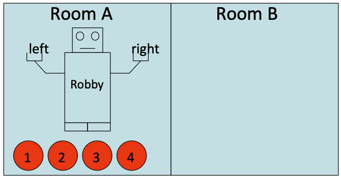

# **Cas d'ús: el problema del Gripper amb Quatre Pilotes**

  
Hi ha un robot que pot moure's entre dues habitacions i recollir o deixar anar pilotes amb qualsevol dels seus dos braços, però només pot portar una pilota per mà al mateix temps. Inicialment, totes les pilotes i el robot es troben a la primera habitació. L'objectiu és portar totes les pilotes a la segona habitació.

## **Descripció del Problema**
- **Objectes**: Dues habitacions, quatre pilotes, dos braços del robot.
- **Predicats**:
  - x és una habitació? `(room ?x)`
  - És una pilota? `(ball ?x)`
  - x és un braç robòtic? `(gripper ?x)`
  - El braç robòtic x està lliure? `(free ?x)`
  - El robot està a l'habitació x? `(at-robby x)` 
  - La pilota x està solta dins l'habitació y? `(at-ball ?x ?y)` 
  - El braç x porta la pilota y? `(carry ?x ?y)`
- **Estat Inicial**: Totes les pilotes i el robot són a la primera habitació. Els dos braços del robot estan buits.
- **Objectiu**: Moure totes les pilotes a la segona habitació.
- **Accions**: El robot pot moure's i recollir o deixar anar una pilota amb cada braç.

## **Objectes**

```pddl
(:objects rooma roomb
          ball1 ball2 ball3 ball4
          left right)
```

## **Predicats**

```pddl
(:predicates (room ?x) (ball ?x) (gripper ?x)
             (at-robby ?x) (at-ball ?x ?y)
             (free ?x) (carry ?x ?y))
```

## **Estat Inicial**

```pddl
(:init (room rooma) (room roomb)
       (ball ball1) (ball ball2) (ball ball3) (ball ball4)
       (gripper left) (gripper right)
       (free left) (free right)
       (at-robby rooma)
       (at-ball ball1 rooma) (at-ball ball2 rooma)
       (at-ball ball3 rooma) (at-ball ball4 rooma))
```

## **Objectiu**

```pddl
(:goal (and (at-ball ball1 roomb)
            (at-ball ball2 roomb)
            (at-ball ball3 roomb)
            (at-ball ball4 roomb)))
```

## **Esquemes d'Acció**

### **Moviment**

- **Descripció**: El robot es mou de `x` a `y`.
- **Precondició**: `x` i `y` són habitacions i el robot està a l'habitació `x`.
- **Efecte**: el robot passa a ser a l'habitació `y` i deixa d'estar a la `x`.

```pddl
(:action move
    :parameters (?x ?y)
    :precondition (and (room ?x) (room ?y) (at-robby ?x))
    :effect (and (at-robby ?y) (not (at-robby ?x))))
```

### **Recollir**

- **Descripció**: El robot recull `x` a `y` amb `z`.
- **Precondició**: `x` és una pilota, `y` una habitació, `z` un braç robotic, la pilota `x` està a l'habitació `y`i el robot també, i el braç `z` està lliure.
- **Efecte**: el braç `z` porta la pilota `x` i ja no es pot dir que està solta a l'habitació `y` i el braç `z`ja no està disponible.
```pddl
(:action pick-up
    :parameters (?x ?y ?z)
    :precondition (and (ball ?x) (room ?y) (gripper ?z)
                       (at-ball ?x ?y) (at-robby ?y) (free ?z))
    :effect (and (carry ?z ?x) (not (at-ball ?x ?y)) (not (free ?z))))
```

### **Deixar anar**

- **Descripció**: El robot deixa anar `x` a `y` des de `z`.
- **Precondició**: `x` és una pilota, `y` una habitació, `z` un braç robotic, la pilota `x` la porta el braç `z`, el robot està a l'habitació `y`.
- **Efecte**: el braç `z` ja no porta la pilota `x` sinó que està lliure i la pilota `x` està solta a l'habitació `y`.

```pddl
(:action drop
    :parameters (?x ?y ?z)
    :precondition (and (ball ?x) (room ?y) (gripper ?z)
                       (carry ?z ?x) (at-robby ?y))
    :effect (and (at-ball ?x ?y) (free ?z) (not (carry ?z ?x))))
